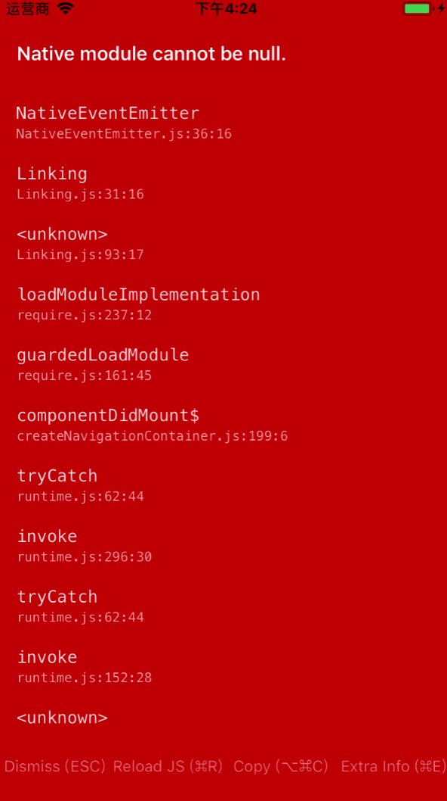

# iOS原生集成React-Native遇到的坑总结

时间:
> 2018-08-10

本例使用的环境:

> react-native: 0.56.0
> react: 16.3.1
> xcode: 9.4.1
> 语言: objc

## 前言

由于项目需要在原有的iOS项目中混编ReactNative项目,做了一个小demo进行测试,一开始遇到的非常多的问题,快崩溃了,不断的进行尝试终于把项目调通了.

## 一.集成步骤

详细配置文件可以查看附录

### 1.项目底下创建package.json文件

### 2.进入项目文件夹,在命令行下执行npm install

### 3.创建Podfile文件,然后执行pod install

### 4.用xcode打开ReactTest.xcworkspace项目,然后在需要加载ReactNative项目的地方添加代码


## 二.遇到的坑:


1.加载jsbundle一直提示Native module cannot be null，查了好多资料一直没办法解决，通过跟ReactNative自动生成的比较偶然发现有个RCTLinking模块没加进来，直接在Podfile用RCTLinking,提示找不到该模块，后面打开React.podspec发现RCTLinking在iOS下的名称为RCTLinkingIOS，后面把RCTLinkingIOS加进了就可以正常运行。




2.podfile不要使用使用use_frameworks,否则会提示错误.

通过解决以上两个大坑终于实现了加载ReactNative项目


## 三.ReactNative调用iOS原生代码实现导航栏返还功能


创建DismissViewControllerManager类

1.DismissViewControllerManager.h

```
#import <Foundation/Foundation.h>
#import <React/RCTBridgeModule.h>

@interface DismissViewControllerManager : NSObject<RCTBridgeModule>

@end

```

2.DismissViewControllerManager.m

```
#import "DismissViewControllerManager.h"

@implementation DismissViewControllerManager
RCT_EXPORT_MODULE();

RCT_EXPORT_METHOD(goBack)
{
  [[NSNotificationCenter defaultCenter] postNotification:[NSNotification notificationWithName:@"dismissViewController" object:nil]];
}
@end

```

3.在需要调用的地方加入如下代码

> ViewController.m

```
 (void)viewDidLoad {
    [super viewDidLoad];
    [[NSNotificationCenter defaultCenter] addObserver:self selector:@selector(goBack) name:@"dismissViewController" object:nil];
    ...
    }
    
    - (void)goBack {
    NSLog(@"hello world!");
    [self dismissViewControllerAnimated:YES completion:nil];
}

```


## 附录.关键配置和代码

### 1.package.json

```
{
  "name": "ReactTest",
  "version": "0.0.1",
  "description": "sample of react native embedding ios",
  "main": "index.js",
  "private": true,
  "scripts": {
    "start": "node node_modules/react-native/local-cli/cli.js start"
  },
  "author": "danke77",
  "license": "ISC",
  "dependencies": {
    "react": "^16.3.1",
    "react-native": "^0.56.0",
    "crypto": "^1.0.1",
    "crypto-js": "^3.1.9-1",
    "react-native-communications": "^2.2.1",
    "react-native-smart-button": "^2.0.4-beta.1",
    "react-native-smart-gesture-password": "^2.1.0",
    "react-navigation": "^2.6.2"
  },
  "devDependencies": {
    "react": "~16.3.1"
  }
}

```

### 2.Podfile

```
platform :ios, '9.0'
# target的名字一般与你的项目名字相同
target 'ReactTest' do

pod 'yoga', :path => './node_modules/react-native/ReactCommon/yoga/yoga.podspec'
pod 'Folly', :podspec => './node_modules/react-native/third-party-podspecs/Folly.podspec'

pod 'React', :path => './node_modules/react-native', :subspecs => [ 
'Core',
'RCTAnimation',
'RCTActionSheet',
'RCTBlob',
'RCTGeolocation',
'RCTLinkingIOS',
'RCTSettings',
'RCTVibration',
'RCTImage',
'CxxBridge',
'RCTNetwork',
'RCTText',
'RCTWebSocket',
# 添加其他你想在工程中使用的依赖。
]


end
```

### 3.在原生ViewController.h调用ReactNative项目

```
#import "ViewController.h"
#import <React/RCTRootView.h>

@interface ViewController ()

@end

@implementation ViewController

- (void)viewDidLoad {
    [super viewDidLoad];
    // Do any additional setup after loading the view, typically from a nib.
    NSURL *jsCodeLocation;
       jsCodeLocation = [NSURL URLWithString:@"http://192.168.0.68:8081/index.bundle?platform=ios&dev=true"];

    //jsCodeLocation = [[RCTBundleURLProvider sharedSettings] jsBundleURLForBundleRoot:@"index.ios" fallbackResource:nil];
    //jsCodeLocation = [[NSBundle mainBundle] URLForResource:@"index" withExtension:@"bundle"];

    RCTRootView *rootView = [[RCTRootView alloc] initWithBundleURL:jsCodeLocation
                                                        moduleName:@"AwesomeProject"
                                                 initialProperties:nil
                                                     launchOptions:nil];
    rootView.backgroundColor = [[UIColor alloc] initWithRed:1.0f green:1.0f blue:1.0f alpha:1];
    self.view = rootView;

}


@end

```


